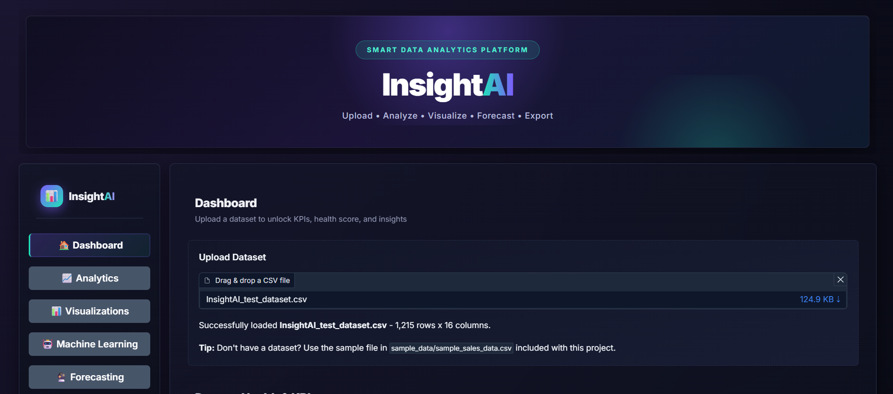
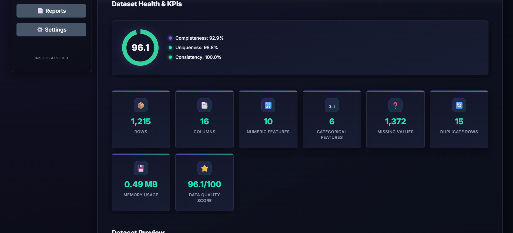
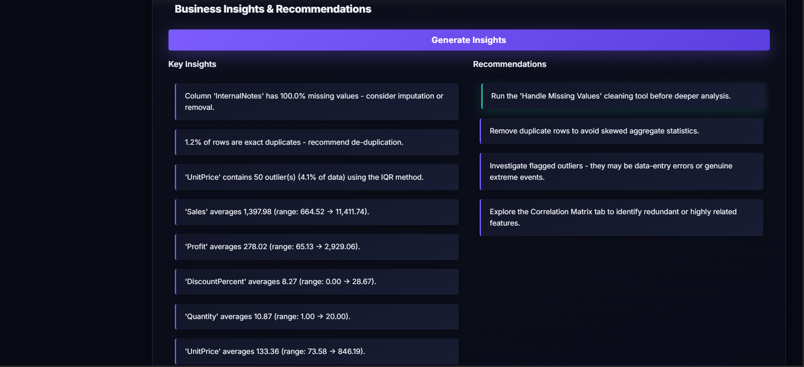
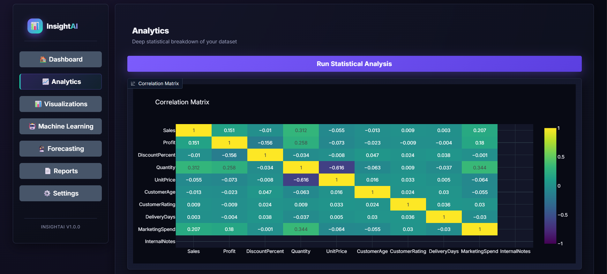
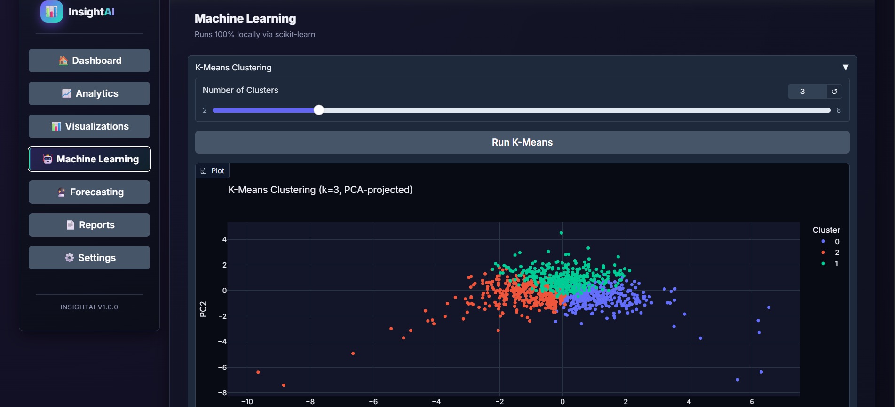
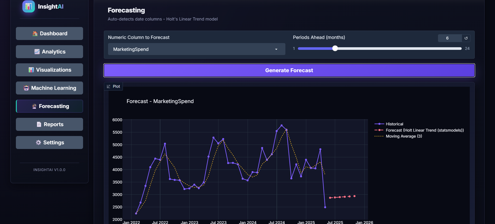
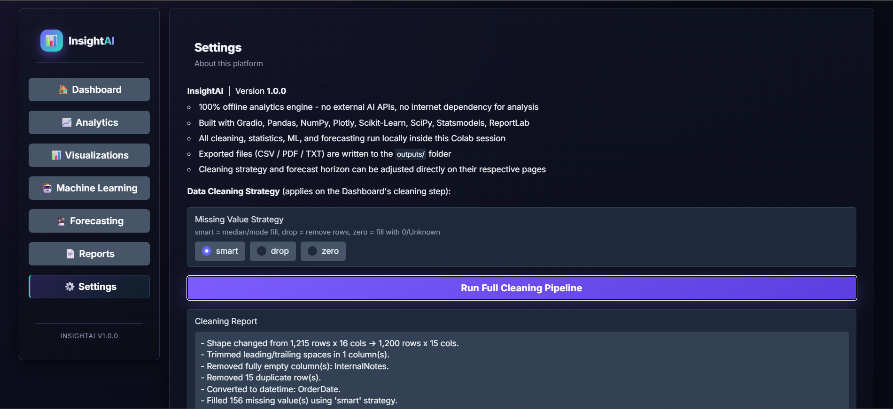

# 📊 InsightAI — Smart Data Analytics Platform

**InsightAI** is a fully offline, rule-based data analytics SaaS platform that turns any raw CSV into a complete business intelligence report. Powered by **Pandas**, **Scikit-Learn**, **Plotly**, and **Gradio**, it delivers automated data cleaning, statistical analysis, machine learning, forecasting, and business insights — all through a premium, enterprise-style dashboard with zero API keys and zero internet dependency for analysis.

Whether you're exploring a new dataset, prototyping a data science workflow, or showcasing analytics capabilities, InsightAI turns raw rows and columns into instant, decision-ready intelligence.


---

## 🎯 Features

* **📁 Smart Dataset Profiling** — Instant preview, schema overview, dataset health score, and KPI dashboard the moment a CSV is uploaded.
* **🧹 One-Click Data Cleaning** — Removes duplicates, fixes missing values, converts date columns, trims whitespace, and drops empty columns automatically.
* **📈 Automatic Visualizations** — Bar, line, pie, scatter, histogram, box, violin, correlation heatmap, and pair plots — auto-selected based on your column types.
* **🧠 Rule-Based Insight Engine** — Generates human-readable, analyst-style business insights and actionable recommendations without any external AI API.
* **📐 Deep Statistical Analysis** — Descriptive statistics, skewness & kurtosis, Shapiro-Wilk normality testing, and IQR/Z-score outlier detection.
* **🤖 Machine Learning Toolkit** — K-Means clustering, Linear Regression, Decision Trees, Random Forest feature importance, and PCA — all running locally via Scikit-Learn.
* **🔮 Time Series Forecasting** — Auto-detects date columns and projects future trends using Holt's Linear Trend model, complete with growth rate and seasonality detection.
* **📤 One-Click Report Export** — Download the cleaned dataset, a polished business PDF report, or a plain-text summary report.
* **🎨 Premium Dashboard UI** — A dark, glassmorphism-inspired SaaS interface with a fixed sidebar navigation, gradient accents, and smooth micro-animations.
* **🛡️ Built-In Error Handling** — Gracefully handles empty files, unsupported formats, missing columns, and large datasets.

---

## 📸 Preview

### Dashboard & Upload Workspace


### Dataset Health & KPI Metrics


### Business Insights Engine


### Correlation Matrix & Statistical Analysis


### K-Means Clustering


### Forecasting Model


### Settings & Cleaning Pipeline


---

## 🧰 Tech Stack

| Tool | Purpose |
|------|---------|
| [Gradio](https://www.gradio.app/) | Interactive web dashboard |
| [Pandas](https://pandas.pydata.org/) | Data wrangling & cleaning |
| [NumPy](https://numpy.org/) | Numerical operations |
| [Plotly](https://plotly.com/python/) | Interactive visualizations |
| [Scikit-Learn](https://scikit-learn.org/) | Clustering, regression, trees, PCA |
| [SciPy](https://scipy.org/) | Statistical testing |
| [Statsmodels](https://www.statsmodels.org/) | Time series forecasting |
| [ReportLab](https://www.reportlab.com/) | PDF report generation |
| Python 3.9+ | Core application logic |

---

## 🚀 Getting Started

### 1. Clone the Repository

```bash
git clone https://github.com/<your-username>/insightai.git
cd insightai
```

### 2. Install Dependencies

```bash
pip install -r requirements.txt
```

### 3. Run the Application

```bash
python app.py
```

The dashboard will launch locally in your browser with a shareable public link.

> 💡 **Prefer Google Colab?** Just open a new notebook, paste the contents of `app.py` into a cell, and run it — the first line installs all dependencies automatically.

---

## 🧠 How It Works

1. Upload any CSV file through the Dashboard page.
2. Review the auto-generated dataset health score, KPIs, and schema overview.
3. Run the one-click cleaning pipeline from the Settings page.
4. Explore auto-generated visualizations and the correlation matrix.
5. Generate business insights and recommendations from the rule-based engine.
6. Run clustering, regression, decision trees, or PCA on your data.
7. Forecast future trends if your dataset contains a date column.
8. Export your cleaned dataset, PDF report, or summary report from the Reports page.

The entire pipeline runs locally — no data ever leaves your session.

---

## 📊 Core Analytics

### KPI Dashboard
Tracks:
* Rows & Columns
* Numeric & Categorical Features
* Missing Values & Duplicate Rows
* Memory Usage
* Data Quality Score

### Visual Reports
* Correlation Heatmap & Pair Plots
* Distribution Charts (Histogram, Box, Violin)
* Category Breakdown (Bar, Pie, Top Categories)
* Forecast Trend Charts with Moving Average

### Machine Learning Outputs
* K-Means Cluster Visualization (PCA-projected)
* Linear Regression Predicted vs. Actual Plot
* Decision Tree Confusion Matrix / Regression Fit
* Random Forest Feature Importance Ranking
* PCA 2D Projection with Explained Variance

---

## 📌 Future Improvements

* Multi-file dataset comparison mode
* Natural-language query bar for filtering rows
* Auto-generated PowerPoint export
* Support for Excel (`.xlsx`) and JSON ingestion
* User-saved dashboard templates
* Advanced anomaly detection models

---

## 👤 Author

**Areef Rasool**

BSAI Student | AI, Data Science & Networking Enthusiast

---

## 📄 License

This project is open-source and available under the [MIT License](LICENSE).
